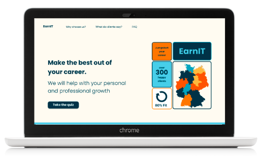

# EarnIT

EarnIT aka Pocket Mentor is a full stack web application, using the MERN stack - Mongo DB, Express.js, React and Node.js.
It offers salary comparisons for positions within the IT sector.



## Table of Contents

- [Introduction](#introduction)
- [Collaborators](#collaborators)
- [Features](#features)
- [Technologies](#technologies)
- [Deployment](#deployment)
- [Local Development](#local-development)

## Introduction

The main objectives were to create and deploy a full stack MERN web application with CRUD functionalities.

- [presentation slides](https://docs.google.com/presentation/d/1fxYdEj5uU77xB0_m8kZwqmGEoh9CMfHt1UYNWJ467VU/edit#slide=id.gc6f80d1ff_0_0)
- [trello board](https://trello.com/b/GOJYpW1Q/earnit)
- [backend](https://earnit-server.onrender.com)
- [frontend](https://visionary-dieffenbachia-36ce76.netlify.app/)
- [figma](https://www.figma.com/proto/XqeXQFTgXo21Mxj1DBWIVu/Pocket-Mentor?node-id=1164-857&scaling=scale-down&page-id=1164%3A830&starting-point-node-id=1164%3A857&show-proto-sidebar=1)
- [mongoDB](https://cloud.mongodb.com/v2/65ddf4f87bf68b0d1ffdb5ee#/overview)

## Collaborators

The main idea for the web app came from the data analytics team:

- [Olivia Ihuoma Ojinji-Kotschka](https://www.linkedin.com/in/olivia-ihuoma-ojinji-kotschka/)
- [Flora Kwong](https://www.linkedin.com/in/kwongflora/)
- [Olga Gnezdilova](https://www.linkedin.com/in/gnezdilova/)


The UX/UI design was created by the UX/UI team:

- [Katya Egorova](https://www.linkedin.com/in/ekaterina-egorova-786bb41a4/)
- [Larissa Bürgelin](https://www.linkedin.com/in/larissa-b%C3%BCrgelin/)

Web development by:

- [Natalia Ogórek](https://www.linkedin.com/in/natalia-og%C3%B3rek/)

## Features

- SPA Frontend - React, multiple views, CRUD
- REST API backend - ExpressJS, MongoDB, Mongoose
- Database models - quiz inputs and user
- User authentication - sign-in, log-in, log-out
- Backend validation - centralized error handling

## Technologies

- React
- Express.js
- Node.js
- Mongo DB, mongoose
- Mongo Compass, Mongo Atlas
- JavaScript (ES6)
- HTML/CSS
- Vite
- Axios
- Node.js and npm
- Git and GitHub
- Render
- Netlify
- React Router
- JSX
- Babel
- ESLint
- Prettier

## Deployment

Backend deployed on Render -->
[click here](https://earnit-server.onrender.com)

Frontend deployed on Netlify -->
[click here](https://visionary-dieffenbachia-36ce76.netlify.app/)

## Local Development

To set up the project locally for development purposes:

```bash
# Installation
npm install

# Run the development server
npm run dev
```

